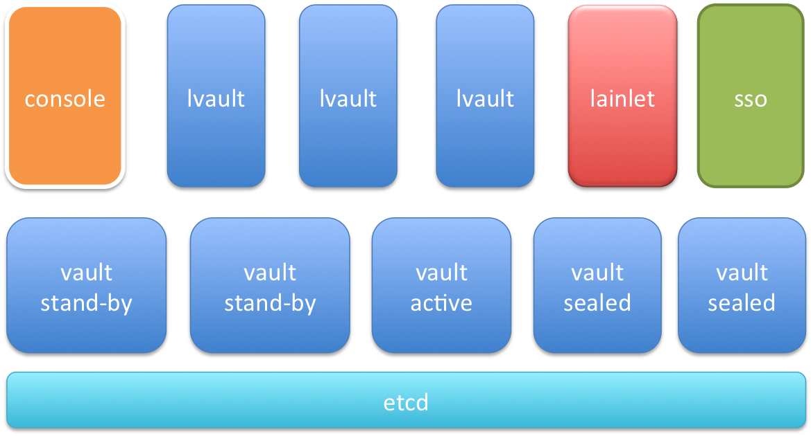

#lvault 简介

lvault 是 lain 为应用提供加密存储一些秘密配置文件的组件，本身作为 lain 的一个 layer 1 应用。

在经过 sso 的身份认证，console 的授权后，应用管理者可以向 lvault 写入秘密配置文件.


##整体设计 (lvault-v2)

lvault 的用户为应用管理者 (app maintainer)，下图为 lvault 涉及的主要组件的结构图.



主要分为三层，

- 最上层为 lvault.web.lvault proc 及其依赖的组件，功能为
	- 与用户的交互，包括一个简单的 UI
	- 处理与 lain 相关的逻辑
		- sso 为应用管理者做身份认证
		- console 授权应用管理者写某应用的秘密文件的权限
	- 作为 vault 的智能代理
		- 依赖 lainlet，自动识别 vault 集群的可用性
- 中间一层为 lvault.web.web proc，直接利用开源组件 [vault](https://www.vaultproject.io) 搭建的 vault 集群。
	- sealed: sealed 的含义是，该节点的内存没有 master key，从而无法解密存储在 etcd 中的密文 
- 最下层是 vault 集群的存储后端 etcd. 当前 vault 相关内容写在 /vault 下

lvault 的两个 proc 均支持 HA.

### 安全性

1. 集群打开认证后，不同应用的 secret files 是互不可见的
	- console 利用 sso 的组管理，为每个应用生成应用管理者组，只有在该组的用户才有权限读写删 secret files
1. vault 的 key 与 token 的管理，只在内存中
	- key 用于加密和解密，token 用于 lvault 内部的权限管理
	- 可以调用 vault 的 api，更新 key 或 token. 
1. 存储后端为 etcd，文件均为加密存储，加密算法为 AES 256 位

## 使用方法

主要分为三步：

1. 用户注册某应用
2. 利用 lvault 的 API 或者图形界面，将 secret files 内容写入 lvault
3. 成功写入后，在 app 的 lain.yaml 中配置这些 secret files, 部署该 app

## Demo

本地集群的 app testsecret 需要用到 secret files

```
appname: testsecret # 全局唯一的应用名

build:  # 描述如何构建应用 image ，例如安装依赖等，供 release 和 test 使用
  base: golang  # 一个已存在的 docker image ，包含编译环境和默认的配置     
  script:  # 会在 docker container 的 /lain/app/ 下 clone 代码并执行下列命令（下同）
    - go build -o testsecret

release:
  dest_base: ubuntu:trusty
  copy:
    - src: testsecret
      dest: /usr/bin/testsecret

test:  # 描述如何从 build 的结果 image 执行测试
  script:   # 这些命令基于 build 的结果 image 运行，任何一个命令返回非0退出码即认为测试失败
    - go test
  
web:  # 定义一个 web 服务
  cmd: testsecret  # 基于 release 产生的发布用 image 运行
  port: 8013  # 服务监听的端口，默认为自动分配一个放在 `PORT` 环境变量里
  secret_files:
    - /a/b/hello
    - secret

notify:
  slack: "#hello"  # 应用相关的通知和报警都会发送到该 slack channel
```

上边的 lain.yaml 文件定义了两个 secret\_files，注意到相对路径实际上是相对于 '/lain/app' 下的路径，我们可以按如下方法将 secret\_files 的内容写入 lvault.
当前的 secret\_files 只支持 root 用户.

下面是用户拿到 access-token 后，可以直接调用 lvault 的 api 写入秘密文件：

```
curl -X PUT  -H "access-token:KIXoIm76QgeGt-ZhGWM11g"  "http://lvault.lain.local/v2/secrets?app=testsecret&proc=testsecret.web.web&path=/a/b/hello" -d '{"content":"hello yx"}'
curl -X PUT  -H "access-token:KIXoIm76QgeGt-ZhGWM11g"  "http://lvault.lain.local/v2/secrets?app=testsecret&proc=testsecret.web.web&path=/lain/app/secret" -d '{"content":"hello world"}'
```

另外，我们对这一过程做了简单的 UI 支持，请严格按照如下步骤进行：

* 打开浏览器访问 http://lvault.`{LAIN_DOMAIN}`/v2/
* 点击自助服务下的 “登录/ LVAULT 集群状态查询” 按钮，按照 app maintainer 的身份登陆；
* 回到首页，只能为已注册的 app 写入秘密文件；

之后我们只需要按照正常部署过程部署该应用，在应用的 container 里的相应路径下便会自动出现这两个文件.

